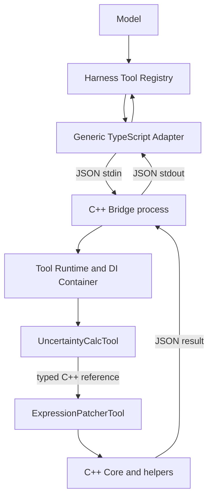
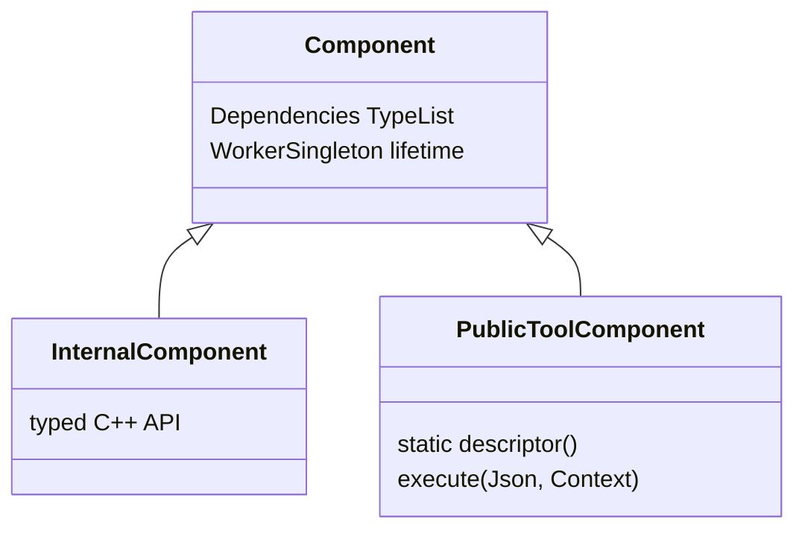

# Architecture

## Vertical path

The TypeScript layer owns transport and Harness lifecycle only. It never selects
business behavior by Tool name. The only per-Tool source of truth is the C++
class that owns `descriptor()` and `execute()`.

## Component model

- `CPP_ADAPTER_REGISTER_PUBLIC_TOOL(Type)` exposes one C++ class as one Model Tool.
- `CPP_ADAPTER_REGISTER_INTERNAL_COMPONENT(Type)` places a helper/service in DI
  without exposing it to the Model.
- `Dependencies = TypeList<A, B>` is declared once on the consuming class. Its
  constructor must accept `A&`, `B&` in that order.
- Registration stores factories only. The registry validates all registrations,
  detects duplicate types/names and missing/cyclic paths, topologically sorts the
  graph, then constructs worker-singleton instances.
- `ComponentLifetime::PerCall` is reserved as an explicit extension point and
  fails closed in v1 instead of silently behaving as a singleton.

## Registration reliability

Each Tool `.cpp` contains its local registrar. `cpp_adapter_tools` is a CMake
`OBJECT` library, and `$<TARGET_OBJECTS:cpp_adapter_tools>` is placed directly on
the Bridge and test link lines. Consequently MSVC archive extraction and
Release `/OPT:REF` cannot omit a registrar merely because no ordinary symbol
references that translation unit.

`file(GLOB ... CONFIGURE_DEPENDS source/cpp/tools/*.cpp)` is intentional: adding a Tool
requires only its `.hpp/.cpp`. The tradeoff is a small configure-time directory
scan and weaker visibility of the source list in code review than an explicit
list. CMake re-runs configuration when the directory contents change.

## Process protocol

The Bridge has two modes:

- `cpp-tool-bridge.exe --describe-tools`: strict protocol `1.0` descriptor list
  plus advertised capabilities.
- no arguments: one request on stdin and one response on stdout.

stdout is JSON-only. Diagnostics use stderr. The Adapter uses `spawn(executable,
args, { shell: false })`, writes the JSON request through stdin, enforces byte
limits, propagates `AbortSignal`, applies the descriptor timeout, terminates the
child on cancellation/timeout/dispose, and rejects malformed JSON, non-zero
exit, signal termination, call-ID mismatch, and protocol/schema drift.

Discovery is the negotiation point. The Adapter accepts additive capabilities
but requires `describe-tools`, `tool-call`, `input-schema-validation`, and
`output-schema-validation`; a missing capability or mismatched protocol version
fails before Harness registration. Request/response parsing remains independent
of Harness and lives in `protocol.ts`.

The C++ boundary validates request arguments and Tool results against the same
class-owned schemas. `ToolError`, standard exceptions, unknown Tools, and Bridge
failures become structured responses; no C++ exception crosses the process.

## rc.5 projection

The checked Harness Tool contract accepts raw JSON Schema in `parameters`, a
required `output { schema, render }`, `timeoutMs`, `isConcurrencySafe`, and an
async `execute(args, exec)`. Only `name`, `description`, and `parameters` are
projected into the native Model schema. Therefore the generic Adapter appends
`whenToUse` and side-effect metadata to the descriptor-derived description,
while output, timeout, and concurrency remain native ToolDefinition fields.

Harness-specific output rules live in `harness-contract.ts`. Validation-only
constraints such as numeric bounds, lengths, and patterns may be omitted from
the rc.5 projection because the C++ boundary still validates the full schema.
Structural forms with no faithful rc.5 representation (`false`, type arrays,
`allOf`, `anyOf`, and `not`) fail registration with
`UNSUPPORTED_HARNESS_OUTPUT_SCHEMA`; they are never silently projected to an
unconstrained schema. `oneOf` remains supported.

The Skill registry supports runtime `skills.register()`, so `skill/SKILL.md` is
parsed and registered by the Plugin. It describes workflow only; parameter and
output schemas remain exclusively in C++ descriptors.
